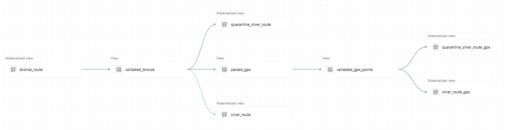

# FATMAP Databricks Data Pipeline

A Databricks data engineering project that ingests, validates, transforms, and structures archived FATMAP ski route data using PySpark, SQL, Delta Lake, and Lakeflow Declarative Pipelines.

## Pipeline Architecture

The pipeline follows a Bronze/Silver architecture:

1. Raw FATMAP route data is loaded from a pickle file into a Bronze materialized view.
2. Bronze records are validated against expected formats and values.
3. Valid records are transformed into a cleaned Silver route table; invalid records are quarantined.
4. GPX XML is parsed into individual track points, which are separately validated and written to Silver and quarantine tables.

## Technologies

- Databricks
- Apache Spark / PySpark
- Databricks SQL
- Delta Lake
- Lakeflow Declarative Pipelines

## Data Source

This project uses archived FATMAP ski route data collected before the service was discontinued. The raw dataset is not included in this repository; only the pipeline code and documentation are published.

## Results

- Processed 11,969 archived FATMAP ski routes.
- Parsed and validated approximately 18 million GPX track points.
